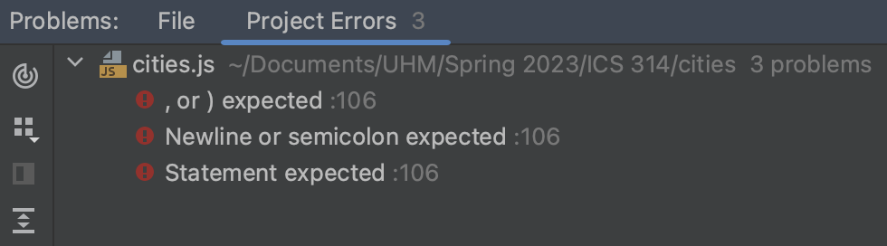

  
People say that we learn through our mistakes. There are no perfect things in this world, however, we can improve and make our lives better in the future. We will not know our mistake unless someone or something tells us where we went wrong. It is for us to accept or acknowledge our mistake. 

In the field of software engineering, every programmer commit mistakes in coding. I don’t believe anybody that will say that they have not made any mistake in terms of coding. In order for a good software engineer to become successful, they should focus on coding standards. I do believe that some coding standards can help anybody to learn any programming language. 

After this first week of using ESLint with IntelliJ, I find that it is very helpful and useful for me in improving my code. It actually does improve my learning towards Javascript. As a beginner to this language, it was both painful and useful for me.  It was painful to see so many errors in the code although there are statements why there was an error in order for me to fix it, so it become useful as well. 
