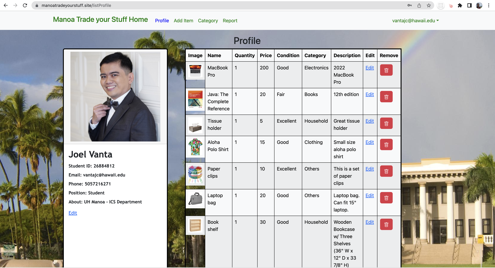

  

## Introduction
As a final project for my ICS 314 class(Software Engineering I), we were tasked to make a working webpage that could help the University of Hawaii community. We created a webpage that can list items that people want to get rid of, or items that can be reuse by other people. 

## How it works
A person needs to sign-up and create a profile using their UH email address. The person can then list an item that they want to sell within the UH community. The buyer and seller can communicate with each other through email.

## Contribution
In this project, I was the one who made the repository, had the idea of the name 'Manoa Trade Your Stuff', created the Listing, Report to Admin page, debug the errors, deployed the project to Digital Ocean and bought the domain name 'manoatradeyourstuff.site'. 

Overall, I can say that our final project was successful. My classmates done their part in order to finish the project on time. I was also happy with the result and the grade I received.

[Check out our site!] (https://manoatradeyourstuff.site)

